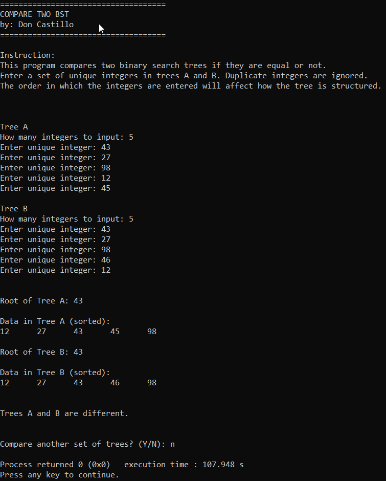

## compareTwoBST
* by Don Castillo
don.castillo@uleth.ca
Student#: 001224541
* Assignment in CPSC 3620: Data Structures and Algorithm

download the repository from: https://github.com/DonCastillo/compareTwoBST.git
### ABOUT
This program checks if two binary search trees are similar or different.

### HOW TO USE THE PROGRAM:

The user will be asked to enter a set of unique integers as data in two binary search trees A and B. The structure of the tree depends on the order of the integers the user has entered. Duplicate integers are treated as one. 

Trees A and B are similar if:
a. They are both empty.
b. They have the same set of data in them in which the order of insertion of each data are also similar.

Examples:
Tree A = { }
Tree B = { }
Both trees are empty, they are similar.

Tree A = { 1, 2, 3, 4 }
Tree B = { 1, 2, 3, 4 }
Both trees have the same data and the order they are inserted are the same, therefore they are similar.

Tree A = { 1, 1, 2, 3, 4 }
Tree B = { 1, 2, 3, 4 }
Duplicates are ignored. Tree A has duplicate data, but both trees are still the same.

Tree A = { 1, 2, 3, 4 }
Tree B = { 1, 2, 3 }
Trees have different sizes. They are different.

Tree A = { 1, 2, 3, 4 }
Tree B = { 4, 3, 2, 1 }
Both trees have the same data but the order in which they are inserted are different, therefore they are different trees.

### HOW TO RUN/COMPILE THE PROGRAM:

The program was written in C++ programming language, and Code::Blocks as its IDE. To run the program, it is better if it's ran via Code::Blocks as well. The repository compareTwoBST contains a comparingBST.cbp that you must open to be directed to the comparingBST workspace. 

To retrieve all necessary files, click on Project >  Add Files Recursively, and from there add all the files in the directory src/ and include/. src/ contains all the .cpp files and include/ contains all the header files. 

Go to Project > Build Options, then select comparingBST that is in the left pane of the window. Click on the Compiler Setting and make sure that "Have g++ follow the C++11 ISO C++ language standard [-std=c++11]" is checked to make sure the program uses the imported libraries with no error. Also make sure that the selected compiler is GNU GCC Compiler.

### HOW TO DOWNLOAD FROM THE REPOSITORY

Using git, enter this command:

git clone https://github.com/DonCastillo/compareTwoBST.git

The online repository is in public and can be accessed anywhere

